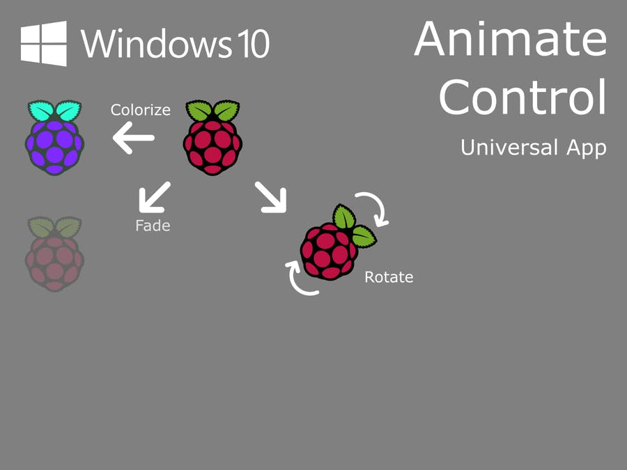

# IoTAnimation

This article will teach you how to animate Windows Universal App(headed application) controls on your Windows 10 IoT device. At the end of the article, you will be able to animate controls such as image, button, grid, textbox, etc.

Refer full article @ https://www.hackster.io/AnuragVasanwala/windows-10-iot-core-animate-control-a32681
